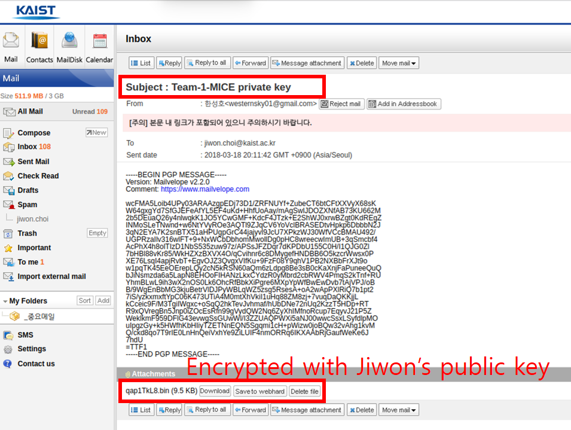
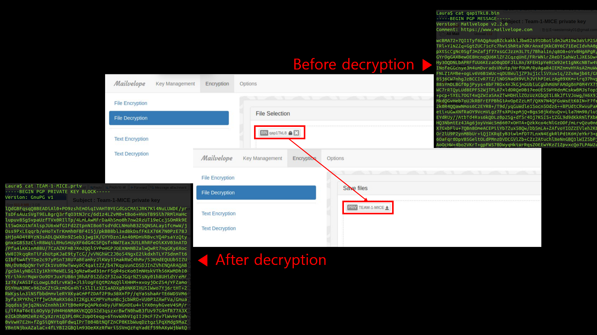
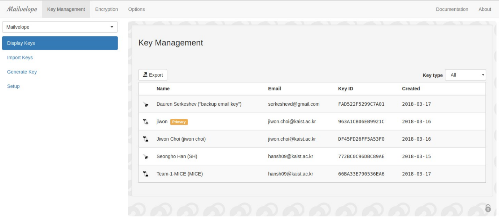

### Safely Distribute Team's secret key

1. 팀장은 Team의 Secret key를 각 팀원들의 Public key로 암호화합니다. 
2. 각 팀원들은 본인의 Secret key를 이용하여 Team의 Secret key를 복호화합니다. 
3. 각 팀원들은 Team의 Secret key를 등록합니다. 

---

---

---

